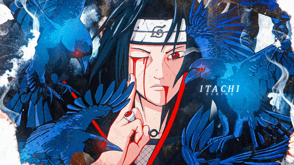
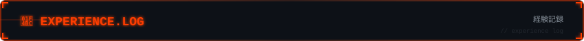
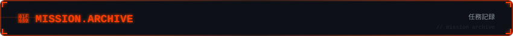
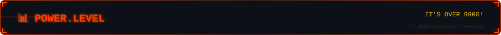
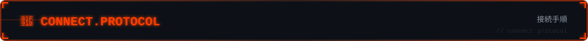
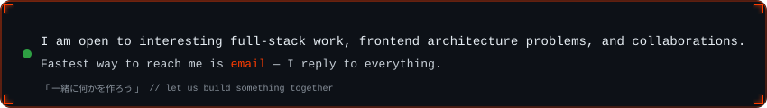

  

<h1 align="center">
  Hi
  
  , I'm Sagar Eknath Bangade
</h1>

  

  
  
  

  
  
  

  

<table>
  <tr>
    <td width="65%" valign="top">

### 🧑‍🚀 About Me

I'm a **Full Stack Software Engineer** who likes making big applications feel small — splitting
monoliths into micro-frontends, cutting bundle sizes, and building component libraries other
teams actually want to use.

- 🔭 Currently a **Software Engineer at InspironLabs**, Bengaluru
- 🧠 **B.Tech in Artificial Intelligence** — AI/ML → Full Stack
- 🏗️ Deep in **micro-frontends**, **design systems**, and **serverless**
- 💬 Ask me about React architecture or anything tech
- ⚡ Fun fact: I'm passionate about aliens and weird stuff

  </td>
  <td width="35%" align="center" valign="center">
    
     
    <b>Believe it! 🍥</b>
  </td>
  </tr>
</table>

  

  

  

  

  

  

  

  

  

  

  

  

 

<table>
  <tr>
    <td width="70%" valign="top">
      

        
      

      

        
      

    </td>
    <td width="30%" align="center" valign="center">
      
        
      
    </td>
  </tr>
</table>

 

<h3 align="center">🐍 Watch the snake eat my contributions</h3>

  <picture>
    <source media="(prefers-color-scheme: dark)" srcset="https://raw.githubusercontent.com/sagarbangade/sagarbangade/output/github-snake-dark.svg" />
    <source media="(prefers-color-scheme: light)" srcset="https://raw.githubusercontent.com/sagarbangade/sagarbangade/output/github-snake.svg" />
    
  </picture>

 

<h3 align="center">📈 Profile Summary Cards</h3>

  
  
  
  
  

 

<h3 align="center">🧊 3D Contribution Calendar</h3>

  

  

  

  

 

  
  

 

  

