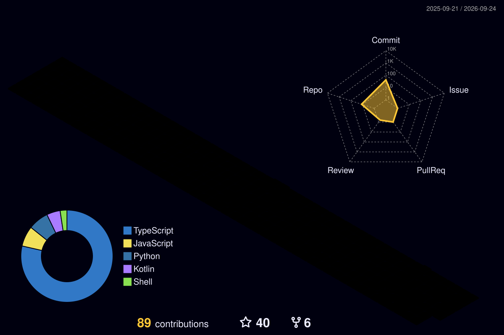

  

<h1 align="center">
  Hi
  
  , I'm Sagar Eknath Bangade
</h1>

  

  
  
  

  
  
  

 

### 🧑‍🚀 About Me

I'm a **Full Stack Software Engineer** who likes making big applications feel small — splitting
monoliths into micro-frontends, cutting bundle sizes, and building component libraries other
teams actually want to use.

- 🔭 Currently a **Software Engineer at InspironLabs**, Bengaluru — React, MUI, Node.js, AWS
- 🧠 **B.Tech in Artificial Intelligence** — I started in AI/ML and came to full stack via NLP and LLM work
- 🏗️ Deep in **micro-frontends (Module Federation)**, **design systems (Storybook)**, and **serverless (AWS Lambda)**
- 💬 Ask me about React architecture, splitting up a legacy frontend, or anything tech
- ⚡ Fun fact: I'm passionate about aliens and weird stuff

 

<h2 align="center">💼 Where I've Worked</h2>

<table>
  <tr>
    <td width="30%"><b>Software Engineer</b> InspironLabs Pvt. Ltd. Bengaluru · 04/2025 – Present</td>
    <td>Responsive <b>React + MUI</b> apps with code splitting and lazy loading. Built the reusable <b>MUI + Storybook</b> component library used across products. <b>Redux</b> for state. Backend work in <b>Node.js, Python, PHP</b> and <b>AWS Lambda</b>.</td>
  </tr>
  <tr>
    <td><b>AI/ML Intern</b> ImmverseAI Innovations Nagpur · 12/2023 – 06/2024</td>
    <td>Prototyped <b>NLP/LLM chatbot</b> features via API integrations — <b>+22% user engagement</b>. Researched emerging AI models and fed findings into the team roadmap.</td>
  </tr>
  <tr>
    <td><b>Full Stack Java Developer Intern</b> Asterisc Technocrat Nagpur · 10/2022 – 12/2023</td>
    <td>Modular <b>JSP / Servlet / Hibernate</b> applications — cut the <b>UAT defect rate by 15%</b>. Hands-on with deployment to test and production.</td>
  </tr>
</table>

 

<h2 align="center">🛠️ My Toolkit</h2>

  <h4>👨‍💻 Languages</h4>
  

    
    
    
    
    
    
    
    
    
    
    
    
  

  <h4>🎨 Frontend</h4>
  

    
    
    
    
    
    
    
    
    
  

  <h4>⚙️ Backend</h4>
  

    
    
    
    
    
    
  

  <h4>🗄️ Databases</h4>
  

    
    
    
  

  <h4>☁️ Cloud, DevOps & Tools</h4>
  

    
    
    
    
    
    
    
    
    
  

  <h4>🧪 Data & AI</h4>
  

    
    
    
    
  

  <h4>🧭 Ways of working</h4>
  

    
    
    
    
    
  

 

<h2 align="center">🚀 Featured Work</h2>

<table>
  <tr>
    <td width="50%" valign="top">
      <h3>🏥 Healthcare Platform 2.0</h3>
      
<b>React · Next.js · Module Federation · Storybook · Material UI</b>

      
Migrated a legacy healthcare application to a <b>micro-frontend architecture</b>, so each module
      scales and deploys independently. Built and maintained the shared Storybook component library that
      keeps design consistent across teams.

      

        
        
      

    </td>
    <td width="50%" valign="top">
      <h3>🎓 E-Learning Platform</h3>
      
<b>Node.js · Python · PHP · AWS Lambda · MySQL · Serverless</b>

      
Shipped features for a large-scale e-learning platform while modernizing and optimizing legacy
      codebases. Implemented backend services and <b>AWS Lambda</b> functions across three runtimes,
      feeding a scalable serverless architecture.

      

        
        
      

    </td>
  </tr>
</table>

 

<h2 align="center">📊 GitHub in Numbers</h2>

  
  

<h3 align="center">🐍 Watch the snake eat my contributions</h3>

  <picture>
    <source media="(prefers-color-scheme: dark)" srcset="https://raw.githubusercontent.com/sagarbangade/sagarbangade/output/github-snake-dark.svg" />
    <source media="(prefers-color-scheme: light)" srcset="https://raw.githubusercontent.com/sagarbangade/sagarbangade/output/github-snake.svg" />
    
  </picture>

<h3 align="center">📈 More stats — profile summary cards</h3>
   
  

    
    
    
    
    
  

<h3 align="center">🧊 3D contribution calendar</h3>
   
  

    
    
  

 

<h2 align="center">🤝 Let's Build Something</h2>

  I'm open to interesting full-stack work, frontend architecture problems, and collaborations. 
  Fastest way to reach me is email — I reply to everything.

  
  

 

  
  
  

  <i>⭐️ From <a href="https://github.com/sagarbangade">sagarbangade</a> — thanks for scrolling this far.</i>

